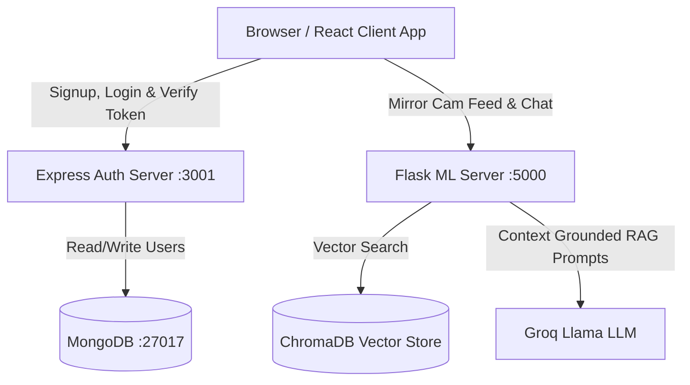
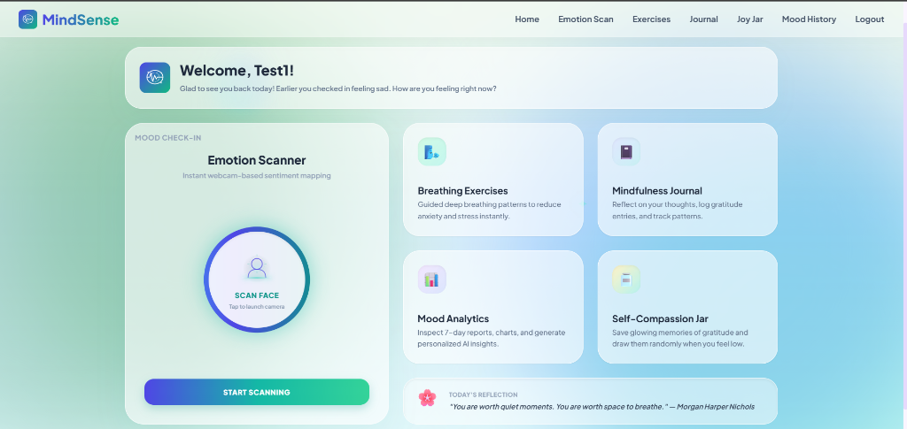
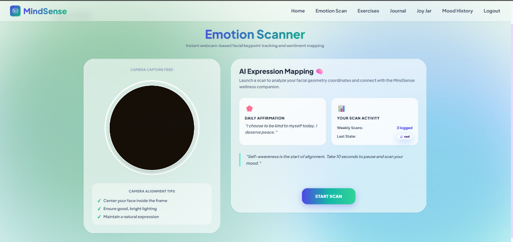

# 🧠 MindSense — AI-Powered Wellness Companion

> A modern, full-stack mental health and wellness platform that combines real-time facial keypoint tracking, custom CNN classification, an AI Coping Companion chatbot backed by Retrieval-Augmented Generation (RAG), and interactive self-care coaches.

---

## 🛠️ Technology Stack & Badges


---

## 📐 System Architecture

The application is structured as a decoupled multi-service architecture:



---

## 🚀 Key Features

*   **📸 Real-Time Emotion Scanner**: Circular mirrored camera feed overlaid with holographic scanning laser sweeps, coordinates, and scopes. Instantly logs percentages of 7 key emotional classifications.
*   **💬 RAG AI Coping Companion**: Chatbot powered by ChromaDB vector store and Groq's Llama LLM. Dynamically generates custom cognitive coping techniques grounded in professional therapy guides.
*   **🚨 Crisis Safety Net**: Real-time keyword scanning automatically routes users to professional emergency channels.
*   **🌬️ Breathing Coach Ring**: Guided breathing circular tracker that pulses, expands, and contracts matching Inhale (4s), Hold (4s), and Exhale (6s) cycles.
*   **🔮 Self-Compassion Jar**: Virtual joy jar with glowing spheres. Drawing a memory shakes the jar and triggers a rising floating bubble animation that pops to reveal self-compassion cards.
*   **📊 Mood Dashboard**: Statistical mood tracking over time powered by MongoDB logs and visualized via Recharts.
*   **🛡️ Secure Route Guards**: Frontend and backend JWT guards that block URL bypass attempts, accompanied by an app-startup session validator and confirmation logout modals.

---

## 📸 Screenshots

### Interactive Mental Wellness Dashboard (Home)


### Real-Time Facial Expression Mapping (Camera Scanner)


---

## ⚙️ How to Run Locally

### Prerequisites
*   Node.js (v18+)
*   Python (3.9+)
*   MongoDB running locally on port `27017`

### 1. Start the MongoDB Express Auth Backend
```bash
cd backend/auth_service
npm install
npm start
```
*Runs on port `3001`.*

### 2. Start the Flask ML & RAG Backend
```bash
cd backend/ml_service
python -m venv venv

# Activate Virtual Environment (Windows)
.\venv\Scripts\activate

# Install packages
pip install -r requirements.txt

# Create environment file (.env)
echo "GROQ_API_KEY=your_groq_api_key" > .env

# Initialize ChromaDB Vector Database
python load_knowledge.py

# Start Server
python app.py
```
*Runs on port `5000`.*

### 3. Start the React Frontend client
```bash
cd frontend
npm install
npm start
```
*Runs on port `3000`.*
